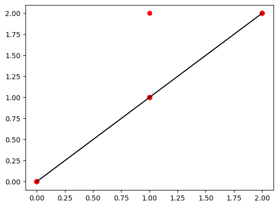
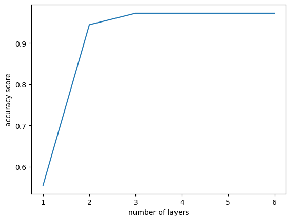

# **HW4**


```python

```


```python
%matplotlib inline
import matplotlib.pyplot as plt
import json
import pandas as pd
import pyclustering
import numpy as np
import sklearn
from sklearn.neural_network import MLPClassifier
from sklearn.datasets import load_wine
wine = load_wine()
print(wine.target)

#data_cols = ['alcohol', 'malic_acid','ash','alcalinity_of_ash','magnesium','total_phenols','flavanoids', 'nonflavanoid_phenols', 'proanthocyanins', 'color_intensity', 'hue', 'od280/od315_of_diluted_wines', 'proline']
```

    [0 0 0 0 0 0 0 0 0 0 0 0 0 0 0 0 0 0 0 0 0 0 0 0 0 0 0 0 0 0 0 0 0 0 0 0 0
     0 0 0 0 0 0 0 0 0 0 0 0 0 0 0 0 0 0 0 0 0 0 1 1 1 1 1 1 1 1 1 1 1 1 1 1 1
     1 1 1 1 1 1 1 1 1 1 1 1 1 1 1 1 1 1 1 1 1 1 1 1 1 1 1 1 1 1 1 1 1 1 1 1 1
     1 1 1 1 1 1 1 1 1 1 1 1 1 1 1 1 1 1 1 2 2 2 2 2 2 2 2 2 2 2 2 2 2 2 2 2 2
     2 2 2 2 2 2 2 2 2 2 2 2 2 2 2 2 2 2 2 2 2 2 2 2 2 2 2 2 2 2]
    

Looks like there's three classes here.  REMEMBER: Python starts with a zero, i.e. 1, 2, 3 is 0, 1, 2.


```python
X = wine.data
y = wine.target
#
print(np.shape(X))
print(np.shape(y))
```

    (178, 13)
    (178,)
    

So now I know there are 13 colums and 178 data points.


```python
from sklearn.model_selection import train_test_split

X_train,X_test,y_train,y_test = train_test_split(X,y,test_size=0.2,random_state=8675309)
```

Splitting the data so I have 80% to train with and 20% to reserve for testing.


```python
from sklearn.preprocessing import StandardScaler
scaler = StandardScaler()
scaler.fit(X_train)

X_train = scaler.transform(X_train)
X_test = scaler.transform(X_test)
```


```python
mlp = MLPClassifier(hidden_layer_sizes=(10, 10, 10), max_iter=2500,random_state=8675309)

mlp.fit(X_train, y_train)
```


<style>#sk-container-id-1 {color: black;background-color: white;}#sk-container-id-1 pre{padding: 0;}#sk-container-id-1 div.sk-toggleable {background-color: white;}#sk-container-id-1 label.sk-toggleable__label {cursor: pointer;display: block;width: 100%;margin-bottom: 0;padding: 0.3em;box-sizing: border-box;text-align: center;}#sk-container-id-1 label.sk-toggleable__label-arrow:before {content: "▸";float: left;margin-right: 0.25em;color: #696969;}#sk-container-id-1 label.sk-toggleable__label-arrow:hover:before {color: black;}#sk-container-id-1 div.sk-estimator:hover label.sk-toggleable__label-arrow:before {color: black;}#sk-container-id-1 div.sk-toggleable__content {max-height: 0;max-width: 0;overflow: hidden;text-align: left;background-color: #f0f8ff;}#sk-container-id-1 div.sk-toggleable__content pre {margin: 0.2em;color: black;border-radius: 0.25em;background-color: #f0f8ff;}#sk-container-id-1 input.sk-toggleable__control:checked~div.sk-toggleable__content {max-height: 200px;max-width: 100%;overflow: auto;}#sk-container-id-1 input.sk-toggleable__control:checked~label.sk-toggleable__label-arrow:before {content: "▾";}#sk-container-id-1 div.sk-estimator input.sk-toggleable__control:checked~label.sk-toggleable__label {background-color: #d4ebff;}#sk-container-id-1 div.sk-label input.sk-toggleable__control:checked~label.sk-toggleable__label {background-color: #d4ebff;}#sk-container-id-1 input.sk-hidden--visually {border: 0;clip: rect(1px 1px 1px 1px);clip: rect(1px, 1px, 1px, 1px);height: 1px;margin: -1px;overflow: hidden;padding: 0;position: absolute;width: 1px;}#sk-container-id-1 div.sk-estimator {font-family: monospace;background-color: #f0f8ff;border: 1px dotted black;border-radius: 0.25em;box-sizing: border-box;margin-bottom: 0.5em;}#sk-container-id-1 div.sk-estimator:hover {background-color: #d4ebff;}#sk-container-id-1 div.sk-parallel-item::after {content: "";width: 100%;border-bottom: 1px solid gray;flex-grow: 1;}#sk-container-id-1 div.sk-label:hover label.sk-toggleable__label {background-color: #d4ebff;}#sk-container-id-1 div.sk-serial::before {content: "";position: absolute;border-left: 1px solid gray;box-sizing: border-box;top: 0;bottom: 0;left: 50%;z-index: 0;}#sk-container-id-1 div.sk-serial {display: flex;flex-direction: column;align-items: center;background-color: white;padding-right: 0.2em;padding-left: 0.2em;position: relative;}#sk-container-id-1 div.sk-item {position: relative;z-index: 1;}#sk-container-id-1 div.sk-parallel {display: flex;align-items: stretch;justify-content: center;background-color: white;position: relative;}#sk-container-id-1 div.sk-item::before, #sk-container-id-1 div.sk-parallel-item::before {content: "";position: absolute;border-left: 1px solid gray;box-sizing: border-box;top: 0;bottom: 0;left: 50%;z-index: -1;}#sk-container-id-1 div.sk-parallel-item {display: flex;flex-direction: column;z-index: 1;position: relative;background-color: white;}#sk-container-id-1 div.sk-parallel-item:first-child::after {align-self: flex-end;width: 50%;}#sk-container-id-1 div.sk-parallel-item:last-child::after {align-self: flex-start;width: 50%;}#sk-container-id-1 div.sk-parallel-item:only-child::after {width: 0;}#sk-container-id-1 div.sk-dashed-wrapped {border: 1px dashed gray;margin: 0 0.4em 0.5em 0.4em;box-sizing: border-box;padding-bottom: 0.4em;background-color: white;}#sk-container-id-1 div.sk-label label {font-family: monospace;font-weight: bold;display: inline-block;line-height: 1.2em;}#sk-container-id-1 div.sk-label-container {text-align: center;}#sk-container-id-1 div.sk-container {/* jupyter's `normalize.less` sets `[hidden] { display: none; }` but bootstrap.min.css set `[hidden] { display: none !important; }` so we also need the `!important` here to be able to override the default hidden behavior on the sphinx rendered scikit-learn.org. See: https://github.com/scikit-learn/scikit-learn/issues/21755 */display: inline-block !important;position: relative;}#sk-container-id-1 div.sk-text-repr-fallback {display: none;}</style><div id="sk-container-id-1" class="sk-top-container"><div class="sk-text-repr-fallback"><pre>MLPClassifier(hidden_layer_sizes=(10, 10, 10), max_iter=2500,
              random_state=8675309)</pre><b>In a Jupyter environment, please rerun this cell to show the HTML representation or trust the notebook. <br />On GitHub, the HTML representation is unable to render, please try loading this page with nbviewer.org.</b></div><div class="sk-container" hidden><div class="sk-item"><div class="sk-estimator sk-toggleable"><input class="sk-toggleable__control sk-hidden--visually" id="sk-estimator-id-1" type="checkbox" checked><label for="sk-estimator-id-1" class="sk-toggleable__label sk-toggleable__label-arrow">MLPClassifier</label><div class="sk-toggleable__content"><pre>MLPClassifier(hidden_layer_sizes=(10, 10, 10), max_iter=2500,
              random_state=8675309)</pre></div></div></div></div></div>


Got the data scaled and transformed.  I don't know how many layers to run so I'm just going to default to 10 since I saw Dr. Clayton do that in her code.  I'll change the max iterations and run with a random state number that's easy to remember... and hum to.


```python
predictions = mlp.predict(X_test)

plt.plot(y_test, predictions, 'ro')
plt.plot([0, 2], [0, 2],'k')
```


    [<matplotlib.lines.Line2D at 0x1b43a497ee0>]


    

    


Plot looks pretty good.  I need to remember that python starts at zero, so that's why the plot numbers end at "2".


```python
from sklearn.metrics import classification_report, confusion_matrix

print(confusion_matrix(y_test,predictions))
print(classification_report(y_test,predictions))
```

    [[15  0  0]
     [ 0  9  1]
     [ 0  0 11]]
                  precision    recall  f1-score   support
    
               0       1.00      1.00      1.00        15
               1       1.00      0.90      0.95        10
               2       0.92      1.00      0.96        11
    
        accuracy                           0.97        36
       macro avg       0.97      0.97      0.97        36
    weighted avg       0.97      0.97      0.97        36
    
    

The confusion matrix is in line with what we can observe in the plot.  The model is very good at predicting class-0 and class-1 (Precision is 100%), and mostly good at predicting class-2 (Precision 92%).  It is also perfect at predicting when something is not going to be in class-1, but 95% and 96% as capable when predicting the other two classes. We should run the model with different layers to see if I can achieve a better result.


```python

scores = {}
scores_list = []
l_range = range(1, 7, 1)

from sklearn import metrics

for l in l_range:
    print(l)
    mlp = MLPClassifier(hidden_layer_sizes=(l), max_iter=2500,random_state=8675309)
    mlp.fit(X_train, y_train)
    y_pred = mlp.predict(X_test)
    scores[l] = metrics.accuracy_score(y_test,y_pred)
    scores_list.append(metrics.accuracy_score(y_test,y_pred))
scores
```

    1
    2
    3
    4
    5
    6
    


    {1: 0.5555555555555556,
     2: 0.9444444444444444,
     3: 0.9722222222222222,
     4: 0.9722222222222222,
     5: 0.9722222222222222,
     6: 0.9722222222222222}


Confusion matrix is promising though I don't like that first number. Lets plot the result.


```python
plt.plot(l_range,scores_list)
plt.xlabel('number of layers')
plt.ylabel('accuracy score')
```


    Text(0, 0.5, 'accuracy score')


    

    


It's got an elbow at the "3" layer mark.  Noice!  Now to run MLPClassifier with three layers and use the "loop" trick that Steele, AKA Zach_Alpha, showed me. Two loops to start.


```python
scores = {}
scores_list = []
a = range(3, 7, 1)
b = range(3, 7, 1)

from sklearn import metrics

for ticks_1 in a:
    for ticks_2 in b:
        mlp = MLPClassifier(hidden_layer_sizes=(ticks_1,ticks_2), max_iter=2500,random_state=8675309)
        mlp.fit(X_train, y_train)
        y_pred = mlp.predict(X_test)
        scores[ticks_1, ticks_2] = metrics.accuracy_score(y_test,y_pred)
        scores_list.append(metrics.accuracy_score(y_test,y_pred))
scores
```


    {(3, 3): 0.9722222222222222,
     (3, 4): 1.0,
     (3, 5): 1.0,
     (3, 6): 0.9444444444444444,
     (4, 3): 0.9722222222222222,
     (4, 4): 1.0,
     (4, 5): 0.9722222222222222,
     (4, 6): 0.9722222222222222,
     (5, 3): 1.0,
     (5, 4): 0.9722222222222222,
     (5, 5): 0.9722222222222222,
     (5, 6): 0.9722222222222222,
     (6, 3): 0.9722222222222222,
     (6, 4): 0.9722222222222222,
     (6, 5): 1.0,
     (6, 6): 0.9722222222222222}


Look at all the 1's! I'mma run one more time with an extra loop just to be sure.


```python
scores = {}
scores_list = []
a = range(3, 7, 1)
b = range(3, 7, 1)
c = range(3, 7, 1)

from sklearn import metrics

for ticks_1 in a:
    for ticks_2 in b:
        for ticks_3 in c:
            mlp = MLPClassifier(hidden_layer_sizes=(ticks_1,ticks_2,ticks_3), max_iter=2500,random_state=8675309)
            mlp.fit(X_train, y_train)
            y_pred = mlp.predict(X_test)
            scores[ticks_1, ticks_2, ticks_3] = metrics.accuracy_score(y_test,y_pred)
            scores_list.append(metrics.accuracy_score(y_test,y_pred))
scores
```


    {(3, 3, 3): 1.0,
     (3, 3, 4): 1.0,
     (3, 3, 5): 1.0,
     (3, 3, 6): 0.9722222222222222,
     (3, 4, 3): 0.9722222222222222,
     (3, 4, 4): 0.9722222222222222,
     (3, 4, 5): 0.9722222222222222,
     (3, 4, 6): 0.9722222222222222,
     (3, 5, 3): 1.0,
     (3, 5, 4): 1.0,
     (3, 5, 5): 0.9722222222222222,
     (3, 5, 6): 0.9722222222222222,
     (3, 6, 3): 0.9722222222222222,
     (3, 6, 4): 0.9722222222222222,
     (3, 6, 5): 1.0,
     (3, 6, 6): 1.0,
     (4, 3, 3): 0.6666666666666666,
     (4, 3, 4): 1.0,
     (4, 3, 5): 0.9444444444444444,
     (4, 3, 6): 1.0,
     (4, 4, 3): 0.9722222222222222,
     (4, 4, 4): 0.9722222222222222,
     (4, 4, 5): 0.9444444444444444,
     (4, 4, 6): 0.9444444444444444,
     (4, 5, 3): 0.9722222222222222,
     (4, 5, 4): 0.9166666666666666,
     (4, 5, 5): 1.0,
     (4, 5, 6): 0.9444444444444444,
     (4, 6, 3): 0.9722222222222222,
     (4, 6, 4): 0.9444444444444444,
     (4, 6, 5): 1.0,
     (4, 6, 6): 0.9444444444444444,
     (5, 3, 3): 1.0,
     (5, 3, 4): 0.9722222222222222,
     (5, 3, 5): 0.9722222222222222,
     (5, 3, 6): 0.9722222222222222,
     (5, 4, 3): 0.9722222222222222,
     (5, 4, 4): 0.9444444444444444,
     (5, 4, 5): 0.9722222222222222,
     (5, 4, 6): 0.9444444444444444,
     (5, 5, 3): 1.0,
     (5, 5, 4): 0.9444444444444444,
     (5, 5, 5): 0.9722222222222222,
     (5, 5, 6): 0.9444444444444444,
     (5, 6, 3): 0.9444444444444444,
     (5, 6, 4): 0.9722222222222222,
     (5, 6, 5): 0.9722222222222222,
     (5, 6, 6): 0.9444444444444444,
     (6, 3, 3): 0.5277777777777778,
     (6, 3, 4): 1.0,
     (6, 3, 5): 0.9722222222222222,
     (6, 3, 6): 0.9722222222222222,
     (6, 4, 3): 1.0,
     (6, 4, 4): 0.9722222222222222,
     (6, 4, 5): 0.9722222222222222,
     (6, 4, 6): 0.9722222222222222,
     (6, 5, 3): 1.0,
     (6, 5, 4): 1.0,
     (6, 5, 5): 0.9444444444444444,
     (6, 5, 6): 0.9722222222222222,
     (6, 6, 3): 0.9722222222222222,
     (6, 6, 4): 0.9722222222222222,
     (6, 6, 5): 0.9722222222222222,
     (6, 6, 6): 0.9722222222222222}


Looks like 3 layers is where it's at. Let's set things up again and run it using the unknown wine dataset.


```python
mlp = MLPClassifier(hidden_layer_sizes=(3,3,3), max_iter=2500,random_state=8675309)
mlp.fit(X_train, y_train)
```


<style>#sk-container-id-2 {color: black;background-color: white;}#sk-container-id-2 pre{padding: 0;}#sk-container-id-2 div.sk-toggleable {background-color: white;}#sk-container-id-2 label.sk-toggleable__label {cursor: pointer;display: block;width: 100%;margin-bottom: 0;padding: 0.3em;box-sizing: border-box;text-align: center;}#sk-container-id-2 label.sk-toggleable__label-arrow:before {content: "▸";float: left;margin-right: 0.25em;color: #696969;}#sk-container-id-2 label.sk-toggleable__label-arrow:hover:before {color: black;}#sk-container-id-2 div.sk-estimator:hover label.sk-toggleable__label-arrow:before {color: black;}#sk-container-id-2 div.sk-toggleable__content {max-height: 0;max-width: 0;overflow: hidden;text-align: left;background-color: #f0f8ff;}#sk-container-id-2 div.sk-toggleable__content pre {margin: 0.2em;color: black;border-radius: 0.25em;background-color: #f0f8ff;}#sk-container-id-2 input.sk-toggleable__control:checked~div.sk-toggleable__content {max-height: 200px;max-width: 100%;overflow: auto;}#sk-container-id-2 input.sk-toggleable__control:checked~label.sk-toggleable__label-arrow:before {content: "▾";}#sk-container-id-2 div.sk-estimator input.sk-toggleable__control:checked~label.sk-toggleable__label {background-color: #d4ebff;}#sk-container-id-2 div.sk-label input.sk-toggleable__control:checked~label.sk-toggleable__label {background-color: #d4ebff;}#sk-container-id-2 input.sk-hidden--visually {border: 0;clip: rect(1px 1px 1px 1px);clip: rect(1px, 1px, 1px, 1px);height: 1px;margin: -1px;overflow: hidden;padding: 0;position: absolute;width: 1px;}#sk-container-id-2 div.sk-estimator {font-family: monospace;background-color: #f0f8ff;border: 1px dotted black;border-radius: 0.25em;box-sizing: border-box;margin-bottom: 0.5em;}#sk-container-id-2 div.sk-estimator:hover {background-color: #d4ebff;}#sk-container-id-2 div.sk-parallel-item::after {content: "";width: 100%;border-bottom: 1px solid gray;flex-grow: 1;}#sk-container-id-2 div.sk-label:hover label.sk-toggleable__label {background-color: #d4ebff;}#sk-container-id-2 div.sk-serial::before {content: "";position: absolute;border-left: 1px solid gray;box-sizing: border-box;top: 0;bottom: 0;left: 50%;z-index: 0;}#sk-container-id-2 div.sk-serial {display: flex;flex-direction: column;align-items: center;background-color: white;padding-right: 0.2em;padding-left: 0.2em;position: relative;}#sk-container-id-2 div.sk-item {position: relative;z-index: 1;}#sk-container-id-2 div.sk-parallel {display: flex;align-items: stretch;justify-content: center;background-color: white;position: relative;}#sk-container-id-2 div.sk-item::before, #sk-container-id-2 div.sk-parallel-item::before {content: "";position: absolute;border-left: 1px solid gray;box-sizing: border-box;top: 0;bottom: 0;left: 50%;z-index: -1;}#sk-container-id-2 div.sk-parallel-item {display: flex;flex-direction: column;z-index: 1;position: relative;background-color: white;}#sk-container-id-2 div.sk-parallel-item:first-child::after {align-self: flex-end;width: 50%;}#sk-container-id-2 div.sk-parallel-item:last-child::after {align-self: flex-start;width: 50%;}#sk-container-id-2 div.sk-parallel-item:only-child::after {width: 0;}#sk-container-id-2 div.sk-dashed-wrapped {border: 1px dashed gray;margin: 0 0.4em 0.5em 0.4em;box-sizing: border-box;padding-bottom: 0.4em;background-color: white;}#sk-container-id-2 div.sk-label label {font-family: monospace;font-weight: bold;display: inline-block;line-height: 1.2em;}#sk-container-id-2 div.sk-label-container {text-align: center;}#sk-container-id-2 div.sk-container {/* jupyter's `normalize.less` sets `[hidden] { display: none; }` but bootstrap.min.css set `[hidden] { display: none !important; }` so we also need the `!important` here to be able to override the default hidden behavior on the sphinx rendered scikit-learn.org. See: https://github.com/scikit-learn/scikit-learn/issues/21755 */display: inline-block !important;position: relative;}#sk-container-id-2 div.sk-text-repr-fallback {display: none;}</style><div id="sk-container-id-2" class="sk-top-container"><div class="sk-text-repr-fallback"><pre>MLPClassifier(hidden_layer_sizes=(3, 3, 3), max_iter=2500, random_state=8675309)</pre><b>In a Jupyter environment, please rerun this cell to show the HTML representation or trust the notebook. <br />On GitHub, the HTML representation is unable to render, please try loading this page with nbviewer.org.</b></div><div class="sk-container" hidden><div class="sk-item"><div class="sk-estimator sk-toggleable"><input class="sk-toggleable__control sk-hidden--visually" id="sk-estimator-id-2" type="checkbox" checked><label for="sk-estimator-id-2" class="sk-toggleable__label sk-toggleable__label-arrow">MLPClassifier</label><div class="sk-toggleable__content"><pre>MLPClassifier(hidden_layer_sizes=(3, 3, 3), max_iter=2500, random_state=8675309)</pre></div></div></div></div></div>


```python
predictions = mlp.predict(X_test)

print(confusion_matrix(y_test,predictions))
print(classification_report(y_test,predictions))
```

    [[15  0  0]
     [ 0 10  0]
     [ 0  0 11]]
                  precision    recall  f1-score   support
    
               0       1.00      1.00      1.00        15
               1       1.00      1.00      1.00        10
               2       1.00      1.00      1.00        11
    
        accuracy                           1.00        36
       macro avg       1.00      1.00      1.00        36
    weighted avg       1.00      1.00      1.00        36
    
    

The confusion matrix backs up the information observed from the scores of the last run with 3 layers and 3 loops.  The model is perfectly predicting all three classes.  The implications here are that this model is likely to report accurately when given new data from the unknown_wine dataset.


```python
classes = {0:'0',1:'1',2:'2'}
mystery = pd.read_csv("unknown_wine.csv")
mystery_cols = ['alcohol', 'malic_acid','ash','alcalinity_of_ash','magnesium','total_phenols','flavanoids', 'nonflavanoid_phenols', 'proanthocyanins', 'color_intensity', 'hue', 'od280/od315_of_diluted_wines', 'proline']
```


```python
mystery
```


<div>
<style scoped>
    .dataframe tbody tr th:only-of-type {
        vertical-align: middle;
    }

    .dataframe tbody tr th {
        vertical-align: top;
    }

    .dataframe thead th {
        text-align: right;
    }
</style>
<table border="1" class="dataframe">
  <thead>
    <tr style="text-align: right;">
      <th></th>
      <th>alcohol</th>
      <th>malic_acid</th>
      <th>ash</th>
      <th>alcalinity_of_ash</th>
      <th>magnesium</th>
      <th>total_phenols</th>
      <th>flavanoids</th>
      <th>nonflavanoid_phenols</th>
      <th>proanthocyanins</th>
      <th>color_intensity</th>
      <th>hue</th>
      <th>od280/od315_of_diluted_wines</th>
      <th>proline</th>
    </tr>
  </thead>
  <tbody>
    <tr>
      <th>0</th>
      <td>2.480115</td>
      <td>1.577093</td>
      <td>1.766757</td>
      <td>7.542816</td>
      <td>43.456511</td>
      <td>0.569810</td>
      <td>0.075239</td>
      <td>0.267335</td>
      <td>0.744527</td>
      <td>0.975456</td>
      <td>0.741519</td>
      <td>2.763938</td>
      <td>1228.781864</td>
    </tr>
    <tr>
      <th>1</th>
      <td>1.074171</td>
      <td>1.125832</td>
      <td>2.557246</td>
      <td>4.421963</td>
      <td>57.339151</td>
      <td>1.677453</td>
      <td>1.027255</td>
      <td>0.266734</td>
      <td>1.037521</td>
      <td>6.093875</td>
      <td>0.400008</td>
      <td>2.629353</td>
      <td>620.263632</td>
    </tr>
    <tr>
      <th>2</th>
      <td>3.516777</td>
      <td>0.819709</td>
      <td>0.462774</td>
      <td>2.328977</td>
      <td>60.776751</td>
      <td>0.950360</td>
      <td>2.312480</td>
      <td>0.114245</td>
      <td>1.453748</td>
      <td>1.566772</td>
      <td>0.249111</td>
      <td>0.948954</td>
      <td>417.939695</td>
    </tr>
    <tr>
      <th>3</th>
      <td>13.189798</td>
      <td>1.402826</td>
      <td>0.153316</td>
      <td>7.621558</td>
      <td>0.440191</td>
      <td>0.103332</td>
      <td>2.878385</td>
      <td>0.016165</td>
      <td>1.558074</td>
      <td>5.961709</td>
      <td>0.338151</td>
      <td>1.608835</td>
      <td>233.606713</td>
    </tr>
    <tr>
      <th>4</th>
      <td>11.973053</td>
      <td>1.838887</td>
      <td>0.945975</td>
      <td>1.269000</td>
      <td>83.484182</td>
      <td>0.934233</td>
      <td>0.448263</td>
      <td>0.038872</td>
      <td>0.488293</td>
      <td>4.358916</td>
      <td>0.482324</td>
      <td>0.084788</td>
      <td>387.198226</td>
    </tr>
    <tr>
      <th>5</th>
      <td>2.284138</td>
      <td>0.048992</td>
      <td>0.211198</td>
      <td>4.088945</td>
      <td>18.957613</td>
      <td>1.192519</td>
      <td>1.647511</td>
      <td>0.005231</td>
      <td>1.038589</td>
      <td>2.101098</td>
      <td>0.237541</td>
      <td>1.672787</td>
      <td>121.134473</td>
    </tr>
    <tr>
      <th>6</th>
      <td>9.463899</td>
      <td>0.787199</td>
      <td>1.863438</td>
      <td>16.869074</td>
      <td>31.736868</td>
      <td>1.470403</td>
      <td>0.534720</td>
      <td>0.206582</td>
      <td>0.633736</td>
      <td>4.444610</td>
      <td>0.033384</td>
      <td>0.925355</td>
      <td>328.508943</td>
    </tr>
    <tr>
      <th>7</th>
      <td>6.453939</td>
      <td>1.676532</td>
      <td>2.153574</td>
      <td>13.765152</td>
      <td>70.390073</td>
      <td>1.749210</td>
      <td>2.721021</td>
      <td>0.252128</td>
      <td>0.152867</td>
      <td>0.582114</td>
      <td>0.507068</td>
      <td>2.055239</td>
      <td>59.729064</td>
    </tr>
    <tr>
      <th>8</th>
      <td>12.740552</td>
      <td>2.854646</td>
      <td>0.932969</td>
      <td>8.626371</td>
      <td>44.557706</td>
      <td>0.405552</td>
      <td>1.105890</td>
      <td>0.219005</td>
      <td>0.393723</td>
      <td>2.706763</td>
      <td>0.983953</td>
      <td>1.070769</td>
      <td>250.301469</td>
    </tr>
    <tr>
      <th>9</th>
      <td>9.686586</td>
      <td>1.232883</td>
      <td>1.475132</td>
      <td>3.560106</td>
      <td>12.221049</td>
      <td>1.229565</td>
      <td>1.495698</td>
      <td>0.153813</td>
      <td>0.886209</td>
      <td>1.506817</td>
      <td>0.939698</td>
      <td>0.921325</td>
      <td>187.457035</td>
    </tr>
  </tbody>
</table>
</div>


```python
mystery_scaled = scaler.transform(mystery)

```

    C:\Users\Brian\anaconda3\lib\site-packages\sklearn\base.py:413: UserWarning: X has feature names, but StandardScaler was fitted without feature names
      warnings.warn(
    

I think I can ignore this warning.  Yeah, I just need the classes and I'm going to give them the most unimaginative names possible.


```python
predictions = mlp.predict(mystery_scaled)
```

Moment of truth, time to run this and predict all ten.


```python
classes = {0:'0',1:'1',2:'2'}
y_predict = mlp.predict(mystery_scaled)

print(classes[y_predict[0]])
print(classes[y_predict[1]])
print(classes[y_predict[2]])
print(classes[y_predict[3]])
print(classes[y_predict[4]])
print(classes[y_predict[5]])
print(classes[y_predict[6]])
print(classes[y_predict[7]])
print(classes[y_predict[8]])
print(classes[y_predict[9]])
```

    1
    1
    1
    1
    2
    1
    2
    1
    1
    1
    

Ok, it's predicting most are class-1 and two of them are class-2.  Now to get the probabilites that this is accurate.


```python
mlp.predict_proba(mystery_scaled)
```


    array([[1.22724253e-01, 8.69606059e-01, 7.66968763e-03],
           [5.64326275e-02, 9.05372162e-01, 3.81952105e-02],
           [3.98126741e-02, 9.48395678e-01, 1.17916482e-02],
           [9.50029429e-02, 8.98116445e-01, 6.88061240e-03],
           [5.11616386e-02, 2.11625811e-04, 9.48626736e-01],
           [3.63199011e-02, 9.59231107e-01, 4.44899156e-03],
           [6.49768720e-03, 2.07052674e-09, 9.93502311e-01],
           [5.99278654e-02, 8.92706205e-01, 4.73659295e-02],
           [5.47755068e-02, 9.39843126e-01, 5.38136754e-03],
           [7.33180737e-02, 9.20542355e-01, 6.13957149e-03]])


Sweet! High confidence that these scores are accurate.


```python

```
